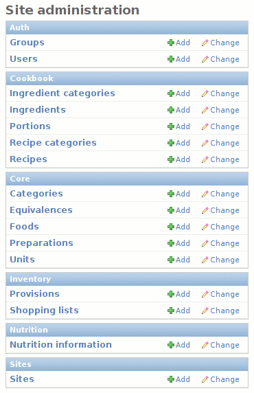

Using the Admin Interface
=========================

This page gives a brief overview of the features provided by Vittles'
administrative interface. You can access it by visiting http://yoursite/admin
and logging in with the admin account you set up when you ran
``manage.py syncdb``.

The *Auth* and *Sites* sections can safely be ignored; Vittles does not
currently do anything with those. The other sections are the major application
areas of Vittles:

    :ref:`core`
        Stores a list of foods, ways of preparing food, categorizations for
        food, units of measurement for food, and how to convert between units of
        measurement
    :ref:`cookbook`
        Keeps track of recipes and the ingredients used in them, as well as
        recipe and ingredient categories and portion sizes
    :ref:`nutrition`
        Nutritional information for each food

In the administration site, you can create, edit, and delete anything from the
above apps. Most of the features should be self-explanatory.

