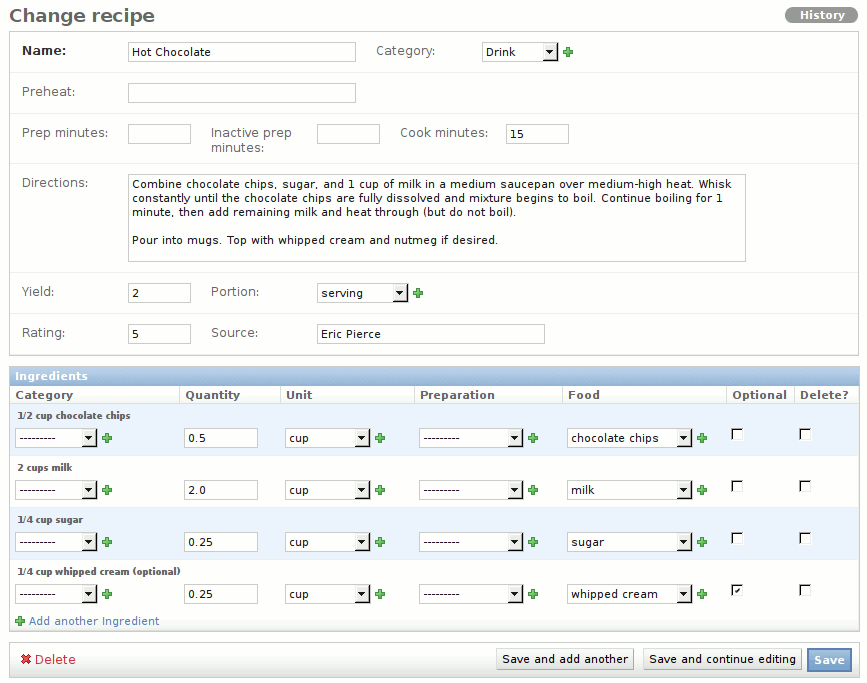

.. _cookbook:

Cookbook
========

A big part of what Vittles does is manage recipes, and the **Cookbook** app
is what handles this.

What you're likely to work with most often is **Recipes**. Each recipe has a
name, and includes a list of ingredients, some paragraphs of instruction, and
several optional fields such as category, rating, preparation time, and yield.

The only required field is **Name**; all others are optional. Some dropdown
fields include a green **+** button, which you can use to add new values if the
one you want isn't present in the dropdown already.

Prep Time
---------

These optional fields indicate how long your recipe takes to prepare and cook;
you can use them in whatever way makes sense to you, but the intended usage is
something like this:

    Prep minutes
        Time spent gathering, preparing, and mixing the ingredients
    Inactive prep minutes
        Time spent waiting, for example when meat is marinating, or bread dough
        is rising
    Cook minutes
        Time spent actually cooking or baking

Again, you can leave these blank if you don't feel like estimating them, but
many published recipes already include this information, so it's easy to enter
if you're so inclined.

Servings
--------

Each recipe is presumed to make some number of servings, but it's up to you how
you would like to define your servings. Obviously, some people eat bigger
servings than others, so you may want to specify what exactly you mean by "Makes
4 servings".

For example, a muffin recipe may make 12 muffins. If that's the case, you can
enter a **Yield** of "12", and a **Portion** of "muffin". When you're making
pancakes, you can specify how many pancakes the recipe makes, and how big the
pancakes are. If you like big pancakes, your recipe may have Yield = "4",
Portion = "6-inch pancake", but if you're going for silver-dollar-size, you
might enter Yield = "24", Portion = "2-inch pancake".

Note that the **Portion** field is singular, and will be automatically
pluralized when the context calls for it. So don't use a portion of "2-inch
pancakes", or else your servings will be Gollumized into "24 2-inch pancakeses."

Ingredients
-----------

When creating a new recipe, you'll have several empty **Ingredient** rows; the
most effective way to navigate these is with the keyboard, since many of the
fields are dropdowns. When you're in a dropdown, as soon as you start typing a
few letters, the first match will be selected. You can then use the arrow keys
to select the value you're looking for. Many times, it only takes two or three
keystrokes to enter the desired value.

The optional **Category** field for each ingredient allows you to divide up the
ingredients into logical groups. For example, muffins call for combining the
*wet* ingredients and *dry* ingredients separately. You could also use it to
separate the *cake* ingredients from the *icing* ingredients. Add new categories
if the existing ones don't suit your needs. For simple recipes, you can omit
this field entirely.

The **Quantity** field accepts both decimals and fractions. For example, if your
recipe calls for two and one-half cups of flour, you could enter "2.5" or
"2-1/2", then tab over to the **Unit** field and type "cu" to get cups. If the
ingredient has no unit (for example, 2 eggs), just leave the "Unit" field empty.

**Preparation** is where you can specify how the ingredient is to be prepared.
Flour may need to be sifted, eggs may need to be beaten, etc. If no preparation
is needed, you can leave this unfilled also.

Next, and most importantly, the **Food** field is where you choose the food
for this ingredient. It's at the end to allow a more natural reading across the
fields; maybe if Jean-Luc Picard had designed it, the food may have come first,
so he could say "Tea, Earl Grey, hot."

At the end of each food row is an **Optional** checkbox, for ingredients that
can be safely omitted from the recipe with no ill effects. When you're editing
an existing recipe, you'll also see a **Delete** checkbox here, which you can
use (in conjunction with the red "Delete" link in the lower-left corner) to
remove ingredients.

Finally, click the **Save** button when you're done editing.

