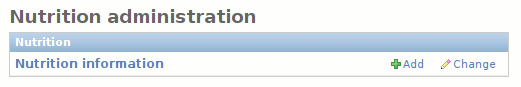
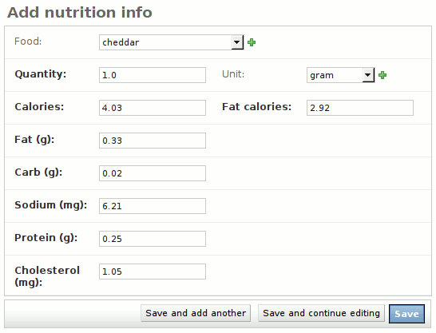

.. _nutrition:

Nutrition
=========

Each food may have its nutritional value specified in multiple ways; for
example, you may want to list the nutritional information for a single large
potato, or for a specific weight or volume of potatoes. This nutritional
information is managed by the **Nutrition** app.

Click the **Add** link to add nutritional information for any food, or
**Change** to view the list of existing nutritional information. Adding new
nutritional information is fairly simple:

Using a standard nutrition label from the food you're entering, simply enter the
numeric values for each nutrient. It's best to use a serving unit of **gram**
whenever possible, though you may want to omit the units for certain foods if
they are not normally measured by weight or volume. For example, the nutritional
info for one egg would have a **Serving size** of 1, with the **Serving unit**
omitted.

The most accurate way to measure nutritional information is by weight, and
Vittles uses grams as a basline for all calculations related to nutritional
information. But it's quite common for recipes to specify volumetric
measurements--1 cup of flour, 2 tablespoons of honey, etc.--and you can't
convert volume to weight unless you know the **density** of whatever you're
measuring.

Water has a density of 1.0 grams per milliliter, but most foods have a higher or
lower density. For example, all-purpose flour weighs about 0.42 g/ml, while
honey weighs about 1.44 g/ml. If you have 1 cup of something, Vittles doesn't
know what it weighs unless it knows what's in the cup. If it's flour, it weighs
100 grams, but if it's honey, it weighs 340 grams. If it's material from the
core of a white dwarf star, it weighs 230 metric tons.

For this reason, correct calculation of nutritional value is very dependent on
having correct densities for your foods. The default value of 1.0 g/ml may be a
reasonable approximation in most cases, but if you notice that your recipes
containing "1 cup chopped nuts" have thousands of extra calories, better
check the density of your nuts.

